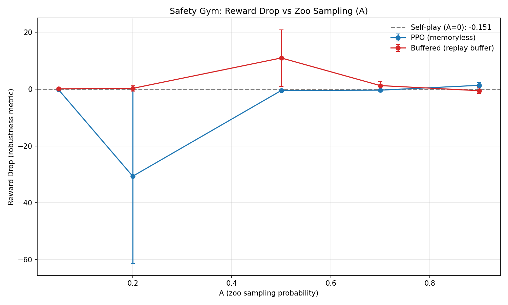
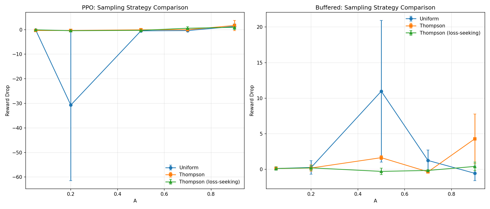
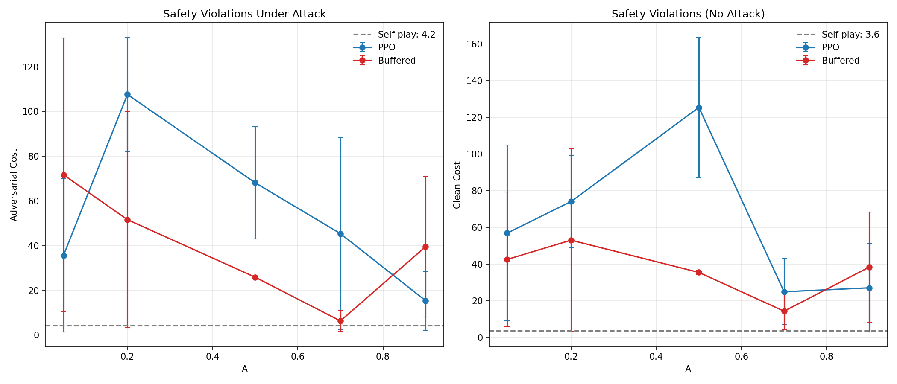
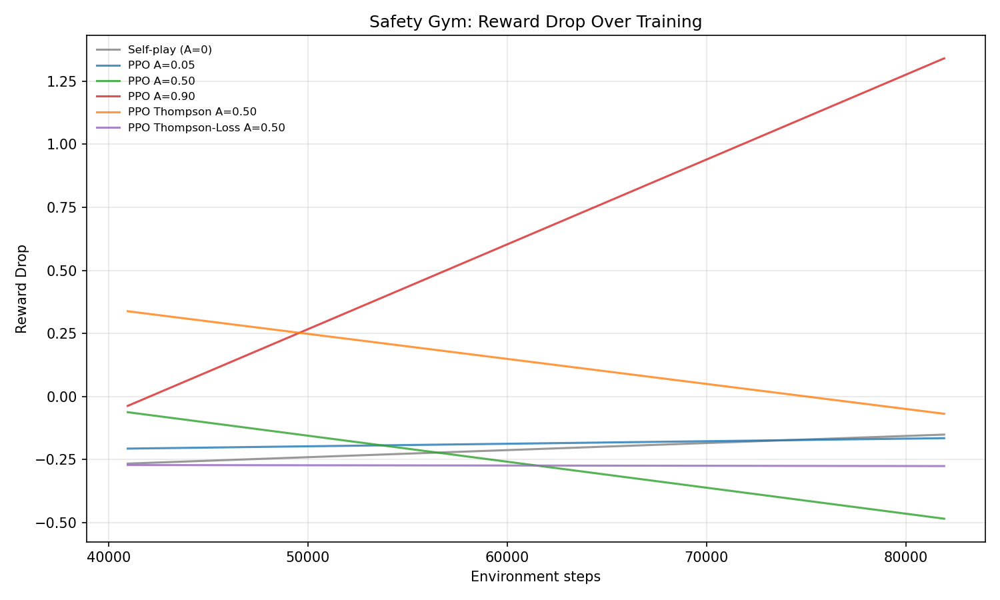

# Safety-Gym-RL: A-Parameter Hypothesis in Adversarial Continuous Control

Third project in the A-parameter series investigating how opponent diversity affects learning:

| Project | Domain | Nash = Best Response to Random? | Zoo Helps? |
|---------|--------|--------------------------------|------------|
| [RPS-RL](https://github.com/kilojoules/RPS_RL) | Rock-Paper-Scissors | Yes | Yes |
| [Kuhn-Poker-RL](https://github.com/kilojoules/Kuhn-Poker-RL) | Kuhn Poker | No | No |
| **Safety-Gym-RL** | Continuous control | N/A (no Nash) | **No** |

## Setup

The **protagonist** is a Point robot navigating to goals while avoiding hazards (`SafetyPointGoal1-v0`, 60D observation, 2D action). The **adversary** perturbs the protagonist's actions: `executed = clip(action + ε·δ, -1, 1)` with `ε=0.1`. The adversary's reward is `-protagonist_reward` (zero-sum).

The **A parameter** controls how often we sample an adversary from a historical zoo vs. training against the latest adversary (A=0 is standard RARL self-play).

**Robustness metric**: `reward_drop = (clean_reward - adv_reward) / |clean_reward|`

## Key Results

### Zoo sampling does not improve robustness



Self-play (A=0) achieves a reward drop of **-0.15** (the adversary actually helps slightly—likely by adding exploration noise). Zoo-trained agents show **high variance** and **no consistent improvement** across A values. The PPO agent at A=0.2 exhibits a pathological -30x reward drop (one seed), while high-A values (0.7–0.9) for both PPO and Buffered show erratic behavior.

This mirrors the Kuhn Poker finding: **when the game doesn't have a fixed Nash equilibrium that also happens to be the best response to a uniform mixture, zoo diversity hurts rather than helps.**

### Thompson sampling reduces variance but doesn't fix the problem



Thompson sampling (both competitive and loss-seeking variants) stabilizes training compared to uniform zoo sampling—note the tighter error bars. However, neither variant consistently outperforms self-play. For the Buffered agent, loss-seeking Thompson at A=0.5 is the only condition that slightly beats self-play.

### Safety violations spike under zoo training



The most striking result: zoo-trained agents accumulate **10-30x more safety violations** than self-play agents, both under attack and in clean evaluation. Self-play produces agents with ~4 cost; zoo training at mid-A values produces agents with 50-120 cost. This suggests zoo diversity doesn't just fail to improve robustness—it actively degrades safety constraint satisfaction.

### Training dynamics



High-A training (A=0.9, red) shows reward drop increasing over time—the agent gets progressively *less* robust. Low-A (A=0.05, blue) tracks close to self-play. Thompson variants at A=0.5 show intermediate behavior.

## Summary Table

| Condition | Reward Drop | Clean Reward | Adv Cost |
|-----------|------------|-------------|----------|
| Self-play (A=0) | -0.15 ± 0.05 | -14.3 ± 10.3 | 4.2 ± 0.2 |
| PPO uniform A=0.05 | -0.17 ± 0.07 | 2.5 | 35.7 |
| PPO uniform A=0.50 | -0.48 ± 0.32 | 5.4 | 68.2 |
| PPO uniform A=0.90 | 1.34 ± 1.01 | -7.7 | 15.4 |
| Buffered uniform A=0.05 | 0.11 ± 0.24 | -5.6 | 71.7 |
| Buffered uniform A=0.50 | 10.97 ± 9.97 | -0.9 | 25.9 |
| Buffered uniform A=0.90 | -0.56 ± 1.04 | -3.8 | 39.5 |

## Interpretation

The A-parameter hypothesis across three domains:

1. **RPS**: Zoo helps because Nash *is* the best response to a uniform mixture of historical policies. More diversity → better generalization.
2. **Kuhn Poker**: Zoo hurts because Nash *is not* the best response to random opponents. Training against diverse historical opponents pulls the agent away from equilibrium.
3. **Safety Gym**: Zoo hurts because there is no fixed Nash to converge to. The protagonist needs to co-adapt with its adversary; sampling stale adversaries from the zoo disrupts this co-adaptation and leads to policies that are neither robust nor safe.

The safety violation result adds a new dimension: in constrained settings, opponent diversity doesn't just fail—it actively violates safety constraints, presumably because the protagonist learns aggressive reward-seeking strategies that happen to work against diverse weak adversaries but don't respect hazard boundaries.

## Architecture

| File | Description |
|------|-------------|
| `env_wrapper.py` | SafetyPointGoal1 wrapper, adversarial perturbation, GAE rollout collection |
| `ppo.py` | Gaussian PPO (2-layer MLP, learnable log_std) |
| `buffered_agent.py` | PPO + trajectory replay buffer with importance sampling correction |
| `zoo.py` | Adversary zoo with uniform/Thompson/Thompson-loss sampling |
| `train_selfplay.py` | RARL baseline (A=0) |
| `train_zoo.py` | Zoo training (PPO protagonist) |
| `train_zoo_buffered.py` | Zoo training (Buffered protagonist) |
| `run_sweep.py` | Parallel experiment orchestration |
| `analyze.py` | Plots and summary tables |

## Usage

```bash
# Install dependencies
pixi install

# Run self-play baseline
pixi run python train_selfplay.py --timesteps 100000 --seed 0

# Run zoo experiment
pixi run python train_zoo.py -A 0.3 --timesteps 100000 --sampling-strategy thompson_loss

# Run full sweep (62 experiments, ~2.5 hours with 8 parallel)
pixi run python run_sweep.py --timesteps 100000 --seeds 2 --parallel 8 --a-values "0.05,0.2,0.5,0.7,0.9"

# Generate plots
pixi run python analyze.py experiments/results/
```

## Sweep Configuration

| Parameter | Value |
|-----------|-------|
| A values | 0.05, 0.2, 0.5, 0.7, 0.9 |
| Algorithms | PPO, Buffered |
| Strategies | uniform, thompson, thompson_loss |
| Seeds | 2 |
| Timesteps | 100k (~49 PPO updates at 2048 steps/rollout) |
| Epsilon | 0.1 |
| Parallel | 8 |
